# Table of contents
  - [Section 1: Course Introduction](#section-1-course-introduction)
  - [Section 2: Installation and Setup](#section-2-installation-and-setup)
    - [Docker](#docker)
    - [MySQL Workbench](#mysql-workbench)
    - [Commands](#commands)
  - [Secction 3: Data Definition Language](#secction-3-data-definition-language)
    - [Data Definition Language (DDL)](#data-definition-language-ddl)
    - [Data Manipulation Language (DML)](#data-manipulation-language-dml)
    - [Data Types](#data-types)
    - [Creating the Coffee Store Database](#creating-the-coffee-store-database)
    - [Modifying Tables: Adding and Removing Columns](#modifying-tables-adding-and-removing-columns)
    - [Deleting Tables](#deleting-tables)
    - [Truncating Tables](#truncating-tables)
  - [Section 4: More On Alter Table](#section-4-more-on-alter-table)
    - [Creating Our Test Database](#creating-our-test-database)
    - [Add and Remove Primary Key](#add-and-remove-primary-key)
    - [Add and Remove Foreign Key](#add-and-remove-foreign-key)
    - [Add Unique Constraint](#add-unique-constraint)
    - [Change Column Name](#change-column-name)
    - [Change Column Data Type](#change-column-data-type)
      - [1. SQL to 'Rename a column' and 'change its data type'.](#1-sql-to-rename-a-column-and-change-its-data-type)
      - [2. SQL to 'Rename a column'.](#2-sql-to-rename-a-column)
      - [3. SQL to 'Change a column’s data type'.](#3-sql-to-change-a-columns-data-type)
    - [Exercises](#exercises)

## Section 1: Course Introduction

## Section 2: Installation and Setup
### Docker
docker-compose.yml

```dockerfile
services:
  mysql:
    image: mysql:8.0
    container_name: mysql-server      # Name the container
    environment:                      # Define environment variables
      MYSQL_ROOT_PASSWORD: admin
      MYSQL_DATABASE: mydatabase
      MYSQL_USER: admin
      MYSQL_PASSWORD: admin
    ports:
      - "3306:3306"                   # Map port 3306
    volumes:
      - mysql-data:/var/lib/mysql     # Persist data using a named volume

volumes:
  mysql-data:                         # Define the named volume for MySQL data
```
To start the MySQL server with Docker Compose, run:
```shell
docker-compose up -d
```
Verify the version of MySQL
```shell
docker exec -it mysql-server mysql --version
```
If you want to start the services again, you can use the following command:
```shell
docker-compose start
```
<div align="right">
  <strong>
    <a href="#table-of-contents" style="text-decoration: none;">↥ Back to top</a>
  </strong>
</div>

### MySQL Workbench
1. Open **MySQL Workbench**
2. Create a New Connection
Click on **+** next to "MySQL Connections" on the main screen.
A dialog box titled Setup New Connection will appear.
3. Configure the Connection
Fill in the following fields:  
  **Connection Name**: Docker MySQL - Give it a name  
  **Hostname**: ``127.0.0.1`` - Enter localhost (if you're running Docker on your local machine).  
  **Port**: ``3306`` (as defined in your docker-compose.yml file).  
  **Username**: ``root`` (as specified in MYSQL_USER in your docker-compose.yml).  
  **Password**: Click **Store in Vault...** and enter ``admin`` (as specified in MYSQL_PASSWORD).  
  4. **Test the Connection**  
  Click the **Test Connection** button.
  If everything is configured correctly, you'll see a success message: "Successfully made the MySQL connection".  
  **If it fails**:  
  Make sure the MySQL container is running (docker ps).  
  Ensure port ``3306`` is open and not blocked by a firewall.

**Notes**:  
Confirm that the container is running:
```shell
docker ps
```
**Steps to apply change**  
Stop and delete the current container:
```shell
docker-compose down
```
Delete old data on your volume
```shell
docker volume rm mysql-data
```
Start over
```shell
docker-compose up -d
```
<div align="right">
  <strong>
    <a href="#table-of-contents" style="text-decoration: none;">↥ Back to top</a>
  </strong>
</div>

### Commands

Create a new database named 'test'
```sql
CREATE DATABASE test;
```
Switch to the 'test' database to work within it
```sql
USE test;
```
Show the list of all databases available
```sql
SHOW DATABASES;
```
Delete the 'test' database
```sql
DROP DATABASE test;
```
<div align="right">
  <strong>
    <a href="#table-of-contents" style="text-decoration: none;">↥ Back to top</a>
  </strong>
</div>

## Secction 3: Data Definition Language
### Data Definition Language (DDL)
SQL commands that are used to **define the structure of the database** objects.  

**CREATE**: Create a **database**, and its **tables**, columns and indexes.  
**ALTER:** Alter the structure of the database objects - **add or remove columns**, indexes, etc.  
**DROP:** Delete **tables**, indexes, and even the entire database.  
**RENAME:** Rename a table.  
**TRUNCATE:** **Clear** out the **contents** of a table. Effectively the same as deleting and re-creating the table.  
### Data Manipulation Language (DML)  
SQL commands that are used to **manipulate** the data.    

**SELECT**: Query the database to **retrieve rows** of data.  
**INSERT**: Insert data into a table.   
**UPDATE**: Change the data in columns of a table (or tables).  
**DELETE**: Delete **rows** in a table (or tables).  

### Data Types  
**Numeric Types**  
**INT** → age INT → **Example**: 25  
**DECIMAL(m, d)** → price DECIMAL(10, 2) → **Example**: 1234.56  
**FLOAT** → temperature FLOAT → **Example**: 36.5  

**String Types**  
**VARCHAR(n)** → name VARCHAR(50) → **Example**: 'John Doe'  
**CHAR(n)** → code CHAR(5) → **Example**: 'A1234'  
**TEXT** → description TEXT → **Example**: 'Long text here'  

**Date and Time Types**  
**DATE** → dob DATE → **Example**: '1990-01-01'  
**DATETIME** → created_at DATETIME → **Example**: '2025-01-28 12:34:56'  
**TIME** → duration TIME → **Example**: '02:30:00'  

**Boolean**  
**BOOLEAN** → is_active BOOLEAN → **Example**: 1  

**Binary Types**  
**BLOB** → image BLOB → **Example**: (binary data)  

**Enumeration Type (ENUM)**   
**ENUM** → status ENUM('active', 'inactive', 'pending') → **Example**: 'active'

<div align="right">
  <strong>
    <a href="#table-of-contents" style="text-decoration: none;">↥ Back to top</a>
  </strong>
</div>

### Creating the Coffee Store Database

```sql
CREATE DATABASE coffee_store;

USE coffee_store;

CREATE TABLE products (
  id INT auto_increment PRIMARY KEY,
  name VARCHAR(30),
  price DECIMAL(3,2)
);

SHOW TABLES;

CREATE TABLE customers(
  id INT auto_increment PRIMARY KEY,
  first_name VARCHAR(30),
  last_name VARCHAR(30),
  gender ENUM('M','F'),
  phone_number VARCHAR(11)
);

CREATE TABLE orders (
  id INT auto_increment PRIMARY KEY,
  product_id INT,
  customer_id INT,
  order_time DATETIME,
  FOREIGN KEY (product_id) REFERENCES products(id),
  FOREIGN KEY (customer_id) REFERENCES customers(id)
);
```
[Script Database](https://github.com/ovidiocbba/MySQL/blob/main/script_database/creating_the_coffee_store_database.sql)

<div align="right">
  <strong>
    <a href="#table-of-contents" style="text-decoration: none;">↥ Back to top</a>
  </strong>
</div>

### Modifying Tables: Adding and Removing Columns
SQL to **Add a Column** to a Table
```sql
ALTER TABLE <tableName>
ADD COLUMN <columnName> <dataType>(<size>);
```
Adds a **new column** to an existing table with the specified **data type** and **size**.  

**Example**  
```sql
ALTER TABLE products
ADD COLUMN coffee_origin VARCHAR(30);
```
**Practice**  
```sql
-- How to add and remove columns from a table

-- Select the database to work with
USE coffee_store;

-- Show the structure of the "products" table to understand its current columns
DESCRIBE products;

-- Add a new column "coffee_origin" to the "products" table
ALTER TABLE products
ADD COLUMN coffee_origin VARCHAR(30);
```
<div align="right">
  <strong>
    <a href="#table-of-contents" style="text-decoration: none;">↥ Back to top</a>
  </strong>
</div>

### Deleting Tables
SQL to **delete** (or drop) a table
```sql
DROP TABLE <tableName>;
```
**Example**
```sql
DROP TABLE test;
```
- Completely deletes the **table**, its **data**, and its **structure** from the database.
- Use this when **you no longer need the table.**

**Practice**
```sql
-- How to delete tables forom a database
-- Step 1: Create a new database
CREATE DATABASE example;

-- Step 2: Switch to the "example" database to work within it
USE example;

-- Step 3: Create a table named "test" with three columns:
CREATE TABLE test (
    id INT AUTO_INCREMENT PRIMARY KEY,
    name VARCHAR(30),
    age INT
);

-- Step 4: Display the structure of the "test" table to verify its columns
DESCRIBE test;

-- Step 5: List all tables in the current database to confirm the "test" table exists
SHOW TABLES;

-- Step 6: Delete (drop) the "test" table from the database
DROP TABLE test;

-- Step 7: Attempt to describe the "test" table again
-- This will produce an error because the table no longer exists
DESCRIBE test;
```
<div align="right">
  <strong>
    <a href="#table-of-contents" style="text-decoration: none;">↥ Back to top</a>
  </strong>
</div>

###  Truncating Tables
SQL to **Truncate** a Table
```sql
TRUNCATE TABLE <tableName>;
```
**Example**
```sql
TRUNCATE TABLE test;
```
- Removes all rows but retains the table structure for future use.
- Use this when you need to **empty the table** but plan to reuse it.


**Practice**
```sql
-- Step 1: Create a new database named "example"
CREATE DATABASE example;

-- Step 2: Switch to the "example" database to work within it
USE example;

-- Step 3: Create a table named "test"
CREATE TABLE test (
    id INT AUTO_INCREMENT PRIMARY KEY,
    name VARCHAR(30),
    age INT
);

-- Step 4: Insert sample data into the "test" table
INSERT INTO test (name, age) 
VALUES  ('Ben', 19), ('Simon', 28), ('Claire', 23);

-- Step 5: Retrieve and display all records from the "test" table
SELECT * FROM test;

-- Step 6: Remove all data from the "test" table without deleting its structure
-- This operation clears the table while keeping its definition intact
TRUNCATE TABLE test;
```
<div align="right">
  <strong>
    <a href="#table-of-contents" style="text-decoration: none;">↥ Back to top</a>
  </strong>
</div>

## Section 4: More On Alter Table
### Creating Our Test Database
```sql
CREATE DATABASE test;

USE test;

CREATE TABLE addresses (
  id INT,
  house_number INT,
  city VARCHAR(20),
  postcode VARCHAR(7)
);

CREATE TABLE people (
  id INT,
  first_name VARCHAR(20),
  last_name VARCHAR(20),
  address_id INT
);

CREATE TABLE pets (
  id INT,
  name VARCHAR(20),
  species VARCHAR(20),
  owner_id INT
);

SHOW TABLES;
```
<div align="right">
  <strong>
    <a href="#table-of-contents" style="text-decoration: none;">↥ Back to top</a>
  </strong>
</div>

### Add and Remove Primary Key
SQL  to **add** a **primary key** to a table.
```sql
ALTER TABLE <table_name>
ADD PRIMARY KEY (<column_name>);
```
**Example**
```sql
ALTER TABLE addresses
ADD PRIMARY KEY (id);
```

SQL to **remove** a **primary key** from a table.
```sql
ALTER TABLE <table_name>
DROP PRIMARY KEY;
```
**Example**
```sql
ALTER TABLE addresses
DROP PRIMARY KEY;
```
SQL to **modify** a **column's** data type:
```sql
ALTER TABLE <table_name>
MODIFY <column_name> <new_data_type>;
```
Changes the data type of an existing column to a new one, for example, from **VARCHAR** to **INT**.
**Example**
```sql
ALTER TABLE addresses
MODIFY id INT;
```

**Practice**
```sql
-- Describe the structure of the "addresses" table
DESCRIBE addresses;

-- Add a primary key to the "addresses" table using the "id" column
ALTER TABLE addresses
ADD PRIMARY KEY (id);

-- Remove the primary key from the "addresses" table
ALTER TABLE addresses
DROP PRIMARY KEY;

-- Modify the "id" column in the "addresses" table to be of type INT
ALTER TABLE addresses
MODIFY id INT;

-- Describe the structure of the "people" table
DESCRIBE people;

-- Add a primary key to the "people" table using the "id" column
ALTER TABLE people
ADD PRIMARY KEY (id);
```
<div align="right">
  <strong>
    <a href="#table-of-contents" style="text-decoration: none;">↥ Back to top</a>
  </strong>
</div>

 ### Add and Remove Foreign Key
 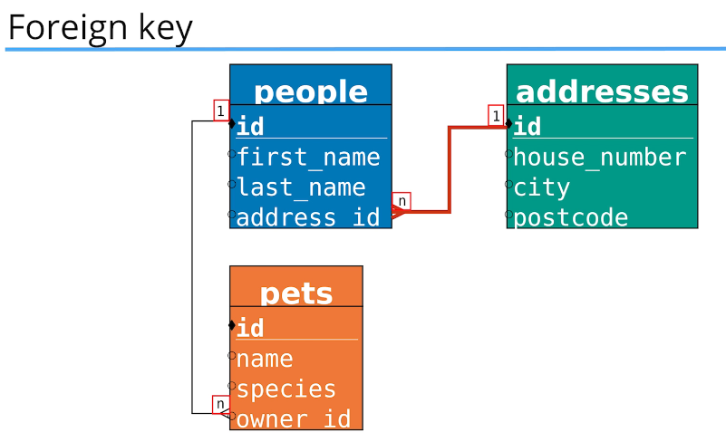
SQL to **add a foreign key** to a table:
```sql
ALTER TABLE <table_name>
ADD CONSTRAINT <constraint_name>
FOREIGN KEY (<column_name>) REFERENCES <referenced_table>(<referenced_column>);
```
**Example**
```sql
ALTER TABLE people
ADD CONSTRAINT FK_PeopleAddress
FOREIGN KEY (address_id) REFERENCES addresses(id);
```
SQL to **remove a foreign key** and its index from a table:
```sql
ALTER TABLE <table_name>
DROP FOREIGN KEY <constraint_name>,
DROP INDEX <constraint_name>;
```
**Example**
```sql
ALTER TABLE people
DROP FOREIGN KEY FK_PeopleAddress,
DROP INDEX FK_PeopleAddress;
```
**Note:**
The ``constraint_name`` is necessary when you want to **delete** or **modify** a constraint in a table. Without a unique name for the constraint, you won't be able to reference it later for changes. When adding a constraint, **it is a good practice** to assign a descriptive name for easy identification.

**Practice**
```sql
-- Describe the structure of the "people" table
-- Ensure "people" has a primary key on "id"
DESCRIBE people;

-- Describe the structure of the "addresses" table
-- Ensure "addresses" has a primary key on "id"
DESCRIBE addresses;

-- Add a foreign key to "people" linking "address_id" to "addresses(id)"
ALTER TABLE people
ADD CONSTRAINT FK_PeopleAddress
FOREIGN KEY (address_id) REFERENCES addresses(id);

-- Remove the foreign key and its index from "people"
ALTER TABLE people
DROP FOREIGN KEY FK_PeopleAddress,
DROP INDEX FK_PeopleAddress;
```

<div align="right">
  <strong>
    <a href="#table-of-contents" style="text-decoration: none;">↥ Back to top</a>
  </strong>
</div>

### Add Unique Constraint
SQL to **add a unique constraint** to a column:
```sql
ALTER TABLE <table_name>
ADD CONSTRAINT <constraint_name> UNIQUE (<column_name>);
```
Ensures that all values in the specified column are unique, preventing duplicate entries.    
**Example**  
```sql
ALTER TABLE pets
ADD CONSTRAINT u_species UNIQUE (species);
```
**Example 2**  
Let's say we have a **users** table, and we want to ensure that emails are **unique** to **prevent duplicate accounts**.

SQL to **remove a unique constraint** from a column:
```sql
ALTER TABLE <table_name>
DROP INDEX <constraint_name>;
```
**Example**  
```sql
ALTER TABLE pets
DROP INDEX u_species;
```
Deletes **the unique constraint,** allowing duplicate values in the column.

**Practice**
```sql
DESCRIBE pets;

-- How to add a unique constraint to a column
ALTER TABLE pets
ADD CONSTRAINT u_species UNIQUE (species);

-- How to remove a unique constraint from a column
ALTER TABLE pets
DROP INDEX u_species;
```
 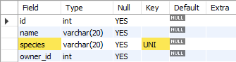

<div align="right">
  <strong>
    <a href="#table-of-contents" style="text-decoration: none;">↥ Back to top</a>
  </strong>
</div>

### Change Column Name
SQL to **rename a column** and **change its data type**:
```sql
ALTER TABLE <table_name>
CHANGE <old_column_name> <new_column_name> <new_data_type>;
```
This **renames the column** and **updates its data type** at the same time.  

**Example**
```sql
ALTER TABLE pets
CHANGE species animal_type VARCHAR(20);
```
Renames the **species** column to **animal_type** and changes its **data type** to **VARCHAR(20)**.

SQL to **rename a column** without changing its data type:
```sql
ALTER TABLE <table_name>
RENAME COLUMN <old_column_name> TO <new_column_name>;
```
This simply **renames the column** while keeping the data type unchanged.  

**Example**
```sql
ALTER TABLE pets
RENAME COLUMN animal_type TO species;
```
Renames the **animal_type** column back to **species**.

**Practice**
```sql
DESCRIBE pets;

-- How to change a column's name
ALTER TABLE pets
CHANGE species animal_type VARCHAR(20);

ALTER TABLE pets
RENAME COLUMN animal_type TO species;
```

 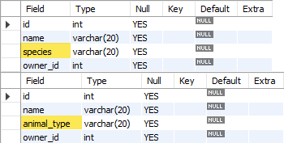

<div align="right">
  <strong>
    <a href="#table-of-contents" style="text-decoration: none;">↥ Back to top</a>
  </strong>
</div>

### Change Column Data Type

#### 1. SQL to 'Rename a column' and 'change its data type'.  
Use this command when you want to perform both operations with a single command.
```sql
ALTER TABLE <table name>
CHANGE COLUMN <current_column_name> <new_column_name> <datatype>;
``` 
**Example**
```sql
ALTER TABLE addresses
CHANGE COLUMN city city VARCHAR(30);
```
#### 2. SQL to 'Rename a column'.  
Use this command when you don’t want to also change the column’s data type.
```sql
ALTER TABLE <table name>
RENAME COLUMN <current_column_name> TO <new_column_name>;
``` 
**Example**
```sql
ALTER TABLE pets
RENAME COLUMN animal_type TO species;
```
#### 3. SQL to 'Change a column’s data type'.  
Use this command when you don’t want to **rename the column** at the same time.
```sql
ALTER TABLE <table name>
MODIFY COLUMN <column name> <data type>;
```
**Example**
```sql
ALTER TABLE addresses
MODIFY COLUMN city CHAR(25);
```
### Exercises
1. Add a primary key to the **id** field in the **pets** table.
```sql
DESCRIBE  pets;

ALTER TABLE pets
ADD PRIMARY KEY(id);
```
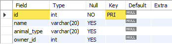

<div align="right">
  <strong>
    <a href="#table-of-contents" style="text-decoration: none;">↥ Back to top</a>
  </strong>
</div>

2. Check the **people** table, and **add a primary key** to the **id** field if it doesn’t already have one.
```sql
DESCRIBE people;

ALTER TABLE people
ADD PRIMARY KEY (id);
```
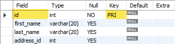  

<div align="right">
  <strong>
    <a href="#table-of-contents" style="text-decoration: none;">↥ Back to top</a>
  </strong>
</div>

3. Add a **foreign key** to the **owner_id** field of the **pets** table, referencing the **id** field in the **people** table.
```sql
DESCRIBE pets;
DESCRIBE people;
 
ALTER TABLE pets
ADD CONSTRAINT FK_PetsOwner
FOREIGN KEY (owner_id) REFERENCES people(id);
```
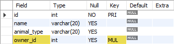  

**Practice**
```sql
-- How to change a column's data type
DESCRIBE addresses;

ALTER TABLE addresses
CHANGE COLUMN city city VARCHAR(30);

ALTER TABLE addresses
MODIFY COLUMN city CHAR(25);

ALTER TABLE addresses
MODIFY COLUMN city int;
```
<div align="right">
  <strong>
    <a href="#table-of-contents" style="text-decoration: none;">↥ Back to top</a>
  </strong>
</div>

4. Add **a column** named **email** to the **people** table.
```sql
DESCRIBE people;

ALTER TABLE people
ADD COLUMN email VARCHAR(20);
```
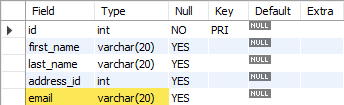  

<div align="right">
  <strong>
    <a href="#table-of-contents" style="text-decoration: none;">↥ Back to top</a>
  </strong>
</div>

5. Add a **unique constraint** to the **email** column in the **people** table.
```sql
DESCRIBE people;
 
ALTER TABLE people
ADD CONSTRAINT u_email UNIQUE (email);
```
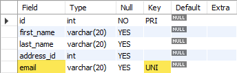  

<div align="right">
  <strong>
    <a href="#table-of-contents" style="text-decoration: none;">↥ Back to top</a>
  </strong>
</div>

6. **Rename** the **name** column in the **pets** table to **first_name**.
```sql
DESCRIBE pets;

ALTER TABLE pets
RENAME COLUMN name TO first_name;
```
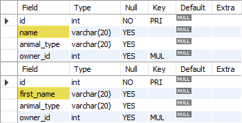  

<div align="right">
  <strong>
    <a href="#table-of-contents" style="text-decoration: none;">↥ Back to top</a>
  </strong>
</div>

7. Change the **postcode** data type to **CHAR(7)** in the **addresses** table.
```sql
DESCRIBE addresses;

ALTER TABLE addresses
MODIFY COLUMN postcode CHAR(7);
```
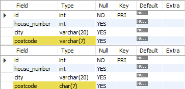  

<div align="right">
  <strong>
    <a href="#table-of-contents" style="text-decoration: none;">↥ Back to top</a>
  </strong>
</div>

## Section 5: Data Manipulation Language
### Inserting Data Into Tables
#### 1. SQL for 'Inserting Data' into a Table
This command is used to insert new records into a table, specifying values for each column in the table
```sql
INSERT INTO <table_name> (<column1>, <column2>, <column3>, ... <column_n>)
VALUES (value1, value2, value3, ... value_n);
```
**Example**
```sql
INSERT INTO products (name, price, coffee_origin)
VALUES ('Espresso', 2.50, 'Brazil');
```
**Practice**
```sql
USE coffee_store;

SHOW tables;

SELECT * FROM products;

INSERT INTO products (name, price, coffee_origin)
VALUES ('Espresso', 2.50, 'Brazil');

INSERT INTO products (name, price, coffee_origin)
VALUES ('Macchiato', 3.00, 'Brazil'), ('Cappuccino', 3.50, 'Costa Rica');

INSERT INTO products (name, price, coffee_origin)
VALUES ('Latte', 3.50, 'Indonesia'), ('Americano', 3.00, 'Brazil'),
('Flat White', 3.50, 'Indonesia'), ('Filter', 3.00, 'India');
```
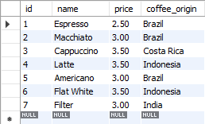 

<div align="right">
  <strong>
    <a href="#table-of-contents" style="text-decoration: none;">↥ Back to top</a>
  </strong>
</div>

### Updating Data in Tables
#### SQL for 'Updating Data' in a Table
This command is used to **update existing records** in a table by specifying the column and new value, with an optional condition to match which records should be updated.
```sql
UPDATE <table name>
SET <column name> = <value>
WHERE <column name> = <match>;
```
**Example**
```sql
UPDATE products
SET coffee_origin = 'Sri Lanka'
WHERE id = 7;
```
**Practice**
```sql
 SELECT * FROM products;

UPDATE products
SET coffee_origin = 'Sri Lanka'
WHERE id = 7;

SET sql_safe_updates = false;

UPDATE products
SET price = 3.25, coffee_origin = 'Ethiopia'
WHERE name = 'Americano';

UPDATE products
SET coffee_origin = 'Colombia'
WHERE coffee_origin = 'Brazil';
```
**Note**: The command SET sql_safe_updates = false; disables the "safe updates" mode in MySQL, which can make your queries potentially risky. 

<div align="right">
  <strong>
    <a href="#table-of-contents" style="text-decoration: none;">↥ Back to top</a>
  </strong>
</div>

### Deleting Data from Tables
#### SQL for 'Deleting Data' from a Table
This command is used to **delete** records from a table based on a **specific condition**.
```sql
DELETE FROM <table_name>  
WHERE <column_name> = <match>; 
```
**Example**
```sql
DELETE FROM people
WHERE gender = 'F';
```
**Practice**
```sql
USE example;
 
CREATE TABLE people (
  id INT auto_increment PRIMARY KEY,
  name VARCHAR(30),
  age INT,
  gender ENUM('F', 'M')
);
 
INSERT INTO people
(name, age, gender)
VALUES ('Emma', 21, 'F'), ('John', 30, 'M'), ('Thomas', 27, 'M'),
('Chris', 44, 'M'), ('Sally', 23, 'F'), ('Frank', 55, 'M');
 
SELECT * FROM people;

DELETE FROM people
WHERE gender = 'F';

DELETE FROM people;
```

<div align="right">
  <strong>
    <a href="#table-of-contents" style="text-decoration: none;">↥ Back to top</a>
  </strong>
</div>

#### Completing the Coffee Store Database
```sql
USE coffee_store;

SELECT * FROM products;
SELECT * FROM customers;
SELECT * FROM orders;
```
**Customers**
```sql
INSERT INTO customers (first_name, last_name, gender, phone_number)
VALUES ('Chris','Martin','M','01123147789'),
       ('Emma','Law','F','01123439899'),
       ('Mark','Watkins','M','01174592013'),
       ('Daniel','Williams','M',NULL),
       ('Sarah','Taylor','F','01176348290'),
       ('Katie','Armstrong','F','01145787353'),
       ('Michael','Bluth','M','01980289282'),
       ('Kat','Nash','F','01176987789'),
       ('Buster','Bluth','M','01173456782'),
       ('Charlie',NULL,'F','01139287883'),
       ('Lindsay','Bluth','F','01176923804'),
       ('Harry','Johnson','M',NULL),
       ('John','Smith','M','01174987221'),
       ('John','Taylor','M',NULL),
       ('Emma','Smith','F','01176984116'),
       ('Gob','Bluth','M','01176985498'),
       ('George','Bluth','M','01176984303'),
       ('Lucille','Bluth','F','01198773214'),
       ('George','Evans','M','01174502933'),
       ('Emily','Simmonds','F','01899284352'),
       ('John','Smith','M','01144473330'),
       ('Jennifer',NULL,'F',NULL),
       ('Toby','West','M','01176009822'),
       ('Paul','Edmonds','M','01966947113');
```

<div align="right">
  <strong>
    <a href="#table-of-contents" style="text-decoration: none;">↥ Back to top</a>
  </strong>
</div>

**Orders**
```sql
INSERT INTO orders (product_id, customer_id, order_time)
VALUES (3, 18, '2022-01-01 01:40:42'),
       (6, 17, '2022-01-03 20:52:17'),
       (7, 12, '2022-01-04 09:17:15'),
       (7, 17, '2022-01-04 15:55:16'),
       (1, 13, '2022-01-05 13:03:56'),
       (6, 5, '2022-01-06 11:42:56'),
       (6, 24, '2022-01-09 02:07:29'),
       (6, 16, '2022-01-12 02:19:12'),
       (4, 20, '2022-01-13 10:51:51'),
       (5, 19, '2022-01-14 16:42:08'),
       (2, 8, '2022-01-17 19:26:45'),
       (2, 5, '2022-01-18 07:14:40'),
       (5, 13, '2022-01-18 08:38:53'),
       (7, 9, '2022-01-22 02:04:46'),
       (6, 22, '2022-01-23 03:58:18'),
       (3, 4, '2022-01-24 18:31:15'),
       (6, 8, '2022-01-28 04:10:12'),
       (2, 7, '2022-01-28 10:55:20'),
       (3, 10, '2022-01-30 14:15:02'),
       (6, 9, '2022-01-30 23:36:50'),
       (2, 3, '2022-01-31 17:21:20'),
       (5, 10, '2022-02-02 19:55:00'),
       (3, 22, '2022-02-06 11:15:53'),
       (6, 16, '2022-02-11 17:26:52'),
       (2, 24, '2022-02-14 15:14:33'),
       (7, 3, '2022-02-15 21:48:10'),
       (4, 14, '2022-02-17 22:58:00'),
       (3, 16, '2022-02-18 00:07:08'),
       (1, 24, '2022-02-18 16:01:32'),
       (5, 14, '2022-02-26 15:07:23'),
       (3, 6, '2022-02-27 09:57:19'),
       (5, 20, '2022-03-04 14:06:52'),
       (5, 13, '2022-03-04 23:28:03'),
       (5, 16, '2022-03-05 21:00:20'),
       (6, 9, '2022-03-06 21:32:30'),
       (1, 22, '2022-03-10 19:32:25'),
       (5, 14, '2022-03-12 05:21:19'),
       (4, 20, '2022-03-13 21:17:58'),
       (3, 3, '2022-03-13 23:47:27'),
       (5, 6, '2022-03-14 22:06:07'),
       (2, 6, '2022-03-16 07:55:59'),
       (5, 18, '2022-03-16 10:47:18'),
       (1, 21, '2022-03-17 00:05:01'),
       (3, 17, '2022-03-18 01:16:45'),
       (1, 10, '2022-03-19 08:34:14'),
       (2, 18, '2022-03-19 08:38:47'),
       (2, 16, '2022-03-20 23:33:25'),
       (5, 21, '2022-03-22 00:08:04'),
       (6, 18, '2022-03-23 12:02:27'),
       (7, 12, '2022-03-25 10:25:23'),
       (2, 16, '2022-03-30 19:48:17'),
       (4, 19, '2022-03-31 18:36:27'),
       (5, 18, '2022-04-04 03:32:19'),
       (1, 17, '2022-04-04 09:33:28'),
       (7, 20, '2022-04-05 12:18:04'),
       (2, 3, '2022-04-06 01:22:00'),
       (3, 10, '2022-04-08 01:07:27'),
       (5, 12, '2022-04-11 17:40:17'),
       (5, 18, '2022-04-13 03:35:11'),
       (1, 16, '2022-04-15 10:32:10'),
       (1, 11, '2022-04-15 13:05:57'),
       (4, 12, '2022-04-16 18:52:35'),
       (6, 18, '2022-05-02 06:10:08'),
       (3, 22, '2022-05-13 22:02:39'),
       (3, 14, '2022-05-19 01:35:16'),
       (6, 2, '2022-05-19 06:03:28'),
       (3, 12, '2022-05-30 23:51:54'),
       (6, 15, '2022-06-04 20:43:00'),
       (7, 23, '2022-06-10 03:07:28'),
       (4, 18, '2022-06-11 18:36:38'),
       (5, 10, '2022-06-14 02:57:14'),
       (4, 24, '2022-06-14 03:41:39'),
       (2, 4, '2022-06-14 07:47:11'),
       (3, 18, '2022-06-15 13:41:34'),
       (1, 11, '2022-06-15 23:53:02'),
       (4, 4, '2022-06-16 16:23:46'),
       (6, 20, '2022-06-19 10:15:41'),
       (7, 3, '2022-06-20 03:21:28'),
       (5, 19, '2022-06-21 15:49:30'),
       (1, 24, '2022-06-24 04:40:20'),
       (5, 13, '2022-06-24 05:16:32'),
       (5, 3, '2022-06-27 12:42:48'),
       (2, 8, '2022-06-30 15:43:09'),
       (1, 12, '2022-07-01 18:10:43'),
       (5, 4, '2022-07-03 19:15:48'),
       (7, 18, '2022-07-05 14:38:47'),
       (1, 18, '2022-07-08 10:51:32'),
       (4, 14, '2022-07-13 10:14:16'),
       (4, 1, '2022-07-18 14:19:05'),
       (7, 4, '2022-07-18 15:32:08'),
       (7, 5, '2022-07-21 03:51:46'),
       (7, 18, '2022-07-24 16:55:59'),
       (5, 23, '2022-07-25 09:55:47'),
       (1, 3, '2022-07-26 18:11:22'),
       (1, 24, '2022-07-28 15:10:55'),
       (7, 20, '2022-08-07 13:08:16'),
       (2, 14, '2022-08-08 07:57:52'),
       (7, 24, '2022-08-12 06:17:46'),
       (3, 10, '2022-08-13 01:52:53'),
       (6, 8, '2022-08-20 12:47:07'),
       (7, 10, '2022-08-21 23:45:39'),
       (1, 5, '2022-08-24 17:18:30'),
       (6, 14, '2022-08-25 18:54:40'),
       (2, 20, '2022-08-29 01:07:00'),
       (2, 12, '2022-08-31 03:27:05'),
       (1, 1, '2022-09-03 12:46:07'),
       (6, 13, '2022-09-05 00:58:57'),
       (6, 14, '2022-09-06 13:16:42'),
       (1, 1, '2022-09-08 06:07:50'),
       (7, 13, '2022-09-12 19:36:39'),
       (1, 1, '2022-09-14 19:52:14'),
       (3, 16, '2022-09-15 17:09:11'),
       (6, 4, '2022-09-15 17:55:44'),
       (2, 4, '2022-09-17 00:55:18'),
       (2, 7, '2022-09-23 11:14:05'),
       (7, 8, '2022-09-25 11:01:44'),
       (2, 21, '2022-09-26 19:11:54'),
       (6, 15, '2022-09-28 19:45:30'),
       (7, 12, '2022-09-29 19:40:24'),
       (5, 14, '2022-09-29 21:33:57'),
       (7, 23, '2022-10-01 13:53:24'),
       (1, 5, '2022-10-01 17:58:55'),
       (2, 3, '2022-10-10 14:44:57'),
       (2, 9, '2022-10-10 19:53:39'),
       (7, 7, '2022-10-12 12:14:31'),
       (6, 22, '2022-10-12 23:14:06'),
       (1, 7, '2022-10-13 00:00:41'),
       (3, 12, '2022-10-14 02:56:38'),
       (5, 17, '2022-10-15 01:50:02'),
       (5, 24, '2022-10-15 08:03:14'),
       (2, 3, '2022-10-15 09:50:50'),
       (7, 5, '2022-10-16 06:41:54'),
       (3, 5, '2022-10-18 16:36:38'),
       (3, 15, '2022-10-24 12:06:19'),
       (6, 18, '2022-10-29 11:01:30'),
       (7, 21, '2022-10-31 05:03:39'),
       (3, 14, '2022-11-01 18:11:58'),
       (4, 11, '2022-11-04 02:01:14'),
       (6, 14, '2022-11-04 11:11:59'),
       (3, 23, '2022-11-04 16:09:35'),
       (6, 20, '2022-11-12 19:56:03'),
       (5, 5, '2022-11-16 22:44:14'),
       (2, 13, '2022-11-18 10:12:00'),
       (2, 14, '2022-11-20 07:36:35'),
       (7, 24, '2022-11-25 05:52:36'),
       (5, 7, '2022-11-29 06:53:56'),
       (6, 7, '2022-12-03 05:56:23'),
       (3, 9, '2022-12-04 08:00:51'),
       (2, 19, '2022-12-05 10:10:35'),
       (6, 15, '2022-12-07 17:52:25'),
       (2, 16, '2022-12-13 02:34:51'),
       (1, 22, '2022-12-14 01:22:55'),
       (4, 24, '2022-12-16 13:08:26'),
       (2, 17, '2022-12-18 09:16:04'),
       (1, 13, '2022-12-18 09:30:16'),
       (1, 20, '2022-12-18 13:27:18'),
       (2, 16, '2022-12-20 11:43:57'),
       (5, 7, '2022-12-31 12:11:08'),
       (2, 14, '2022-12-31 18:43:41'),
       (5, 15, '2023-01-01 02:06:24'),
       (3, 22, '2023-01-01 11:50:28'),
       (6, 19, '2023-01-08 16:51:15'),
       (3, 22, '2023-01-09 01:53:24'),
       (3, 10, '2023-01-09 08:54:10'),
       (7, 16, '2023-01-10 21:53:58'),
       (4, 3, '2023-01-11 20:48:30'),
       (2, 20, '2023-01-12 19:14:00'),
       (5, 21, '2023-01-13 06:07:12'),
       (3, 24, '2023-01-13 06:22:54'),
       (6, 6, '2023-01-14 14:36:54'),
       (7, 24, '2023-01-15 17:18:15'),
       (4, 2, '2023-01-17 03:18:12'),
       (2, 19, '2023-01-17 14:15:49'),
       (4, 18, '2023-01-19 05:08:43'),
       (3, 20, '2023-01-25 13:23:56'),
       (1, 24, '2023-01-31 06:17:11'),
       (3, 6, '2023-01-31 15:01:35'),
       (7, 19, '2023-02-01 19:15:43'),
       (2, 10, '2023-02-05 01:07:36'),
       (3, 19, '2023-02-09 00:23:19'),
       (3, 16, '2023-02-12 13:22:49'),
       (2, 21, '2023-02-12 23:49:48'),
       (2, 24, '2023-02-14 10:09:56'),
       (3, 5, '2023-02-15 13:53:24'),
       (3, 9, '2023-02-16 19:54:44'),
       (2, 20, '2023-02-17 08:22:49'),
       (4, 2, '2023-02-20 17:59:11'),
       (7, 3, '2023-02-20 20:21:43'),
       (6, 17, '2023-02-23 09:34:18'),
       (5, 12, '2023-02-24 10:03:43'),
       (1, 1, '2023-02-25 04:16:35'),
       (5, 12, '2023-02-25 17:39:57'),
       (3, 2, '2023-02-26 10:52:48'),
       (4, 10, '2023-02-27 14:14:27'),
       (7, 18, '2023-03-01 19:08:17'),
       (6, 22, '2023-03-03 09:07:34'),
       (2, 20, '2023-03-07 09:02:13'),
       (4, 10, '2023-03-08 00:43:45'),
       (7, 13, '2023-03-11 10:15:40'),
       (1, 23, '2023-03-12 20:09:35'),
       (1, 8, '2023-03-13 06:40:51'),
       (3, 6, '2023-03-16 18:41:34'),
       (4, 16, '2023-03-17 12:02:08'),
       (5, 18, '2023-03-17 15:58:18'),
       (7, 2, '2023-03-25 04:00:35'),
       (1, 9, '2023-03-26 07:42:31'),
       (1, 21, '2023-03-30 00:43:56'),
       (3, 18, '2023-04-06 10:37:10'),
       (5, 18, '2023-04-11 09:08:31'),
       (2, 2, '2023-04-12 15:40:05'),
       (4, 23, '2023-04-15 23:00:27'),
       (6, 8, '2023-04-16 18:58:47'),
       (1, 1, '2023-04-20 21:55:58'),
       (1, 3, '2023-04-25 06:21:12'),
       (2, 12, '2023-04-27 13:14:46'),
       (5, 16, '2023-04-28 20:52:19'),
       (7, 22, '2023-04-29 09:24:08'),
       (1, 23, '2023-04-29 17:58:14'),
       (2, 3, '2023-04-30 08:43:40'),
       (3, 15, '2023-04-30 19:43:25');
```

<div align="right">
  <strong>
    <a href="#table-of-contents" style="text-decoration: none;">↥ Back to top</a>
  </strong>
</div>

### Section 6: Selecting from a Table
#### Select Statement
```sql
USE coffee_store;

SELECT * FROM customers;

SELECT last_name FROM customers;

SELECT last_name, phone_number FROM customers;
```

<div align="right">
  <strong>
    <a href="#table-of-contents" style="text-decoration: none;">↥ Back to top</a>
  </strong>
</div>

#### Where Clause
```sql
USE coffee_store;

SELECT * FROM products;

SELECT * FROM products
WHERE coffee_origin = 'Colombia';

SELECT * FROM products
WHERE price = 3.00
AND coffee_origin = 'Colombia';

SELECT * FROM products
WHERE price = 3.00
OR coffee_origin = 'Colombia';
```

<div align="right">
  <strong>
    <a href="#table-of-contents" style="text-decoration: none;">↥ Back to top</a>
  </strong>
</div>

### Using Inequality Symbols
```sql
USE coffee_store;
 
/*
!= ... not equal to.
<> ... not equal to (i.e. greater than or less than).
>  ... greater than.
>= ... greater than or equal to.
<  ... less than.
<= ... less than or equal to.
*/
 
SELECT * FROM products;

SELECT * FROM products
-- WHERE price != 3.00;
WHERE price <> 3.00;

SELECT * FROM products
WHERE price > 3.00;

SELECT * FROM products
WHERE price <= 3.00;

SELECT * FROM products
WHERE name < 'D';
```
- The **<** operator performs **a lexicographical comparison**, meaning it compares the strings based on their alphabetical order.

  All names that start with letters before **'D'** (like 'A', 'B', or 'C') **will be selected**.

- **'!='** and **'<>'**
Both operators **perform the same operation**: they return TRUE if the two operands are not equal and FALSE if they are equal.

<div align="right">
  <strong>
    <a href="#table-of-contents" style="text-decoration: none;">↥ Back to top</a>
  </strong>
</div>

### Null Values
```sql
USE coffee_store;
 
SELECT * FROM customers;

SELECT * FROM customers
WHERE phone_number is null;

SELECT * FROM customers
WHERE phone_number is not null;
```

<div align="right">
  <strong>
    <a href="#table-of-contents" style="text-decoration: none;">↥ Back to top</a>
  </strong>
</div>

**Exercise 6**
1. From the '**customers**' table, select the '**first name**' and '**phone number**' of all the '**females**' who have a '**last name**' of '**Bluth**'.
```sql
SELECT first_name, phone_number
FROM customers
WHERE gender = 'F' AND last_name = 'Bluth';
```
2.	From the **products** table, select the **name** for all products that have **a price greater than 3.00**, or a **coffee origin** of **Sri Lanka**.
```sql
SELECT name, price, coffee_origin 
FROM products  
WHERE price > 3.00 OR coffee_origin = 'Sri Lanka';
```
3.	How many **male customers** don’t have a **phone number** entered in the **customers** table.
```sql
SELECT * 
FROM customers 
WHERE gender = 'M' AND phone_number IS NULL;
```

<div align="right">
  <strong>
    <a href="#table-of-contents" style="text-decoration: none;">↥ Back to top</a>
  </strong>
</div>

### In and Not In
#### 1. SQL for 'Selecting Data' with a Condition
This command retrieves all records from a table where a specific column matches one of multiple given values.
```sql
SELECT * FROM <table_name>  
WHERE <column_name> IN (value1, value2, value3, ...);  
```
**Example**
```sql
SELECT * FROM customers  
WHERE last_name IN ('Taylor', 'Bluth', 'Armstrong');  
```
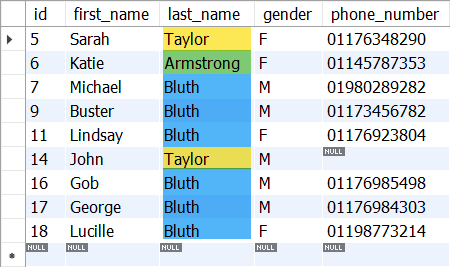  
This example selects all records from the customers table where the **last_name** is either '**Taylor**', '**Bluth**', or '**Armstrong**'.
**Practice**
```sql
USE coffee_store;
 
SELECT * FROM customers;

SELECT * FROM customers
WHERE last_name IN ('Taylor', 'Bluth', 'Armstrong');

SELECT * FROM customers
WHERE first_name NOT IN ('Katie', 'John', 'George');
```
<div align="right">
  <strong>
    <a href="#table-of-contents" style="text-decoration: none;">↥ Back to top</a>
  </strong>
</div>

### Between
#### 1. SQL for 'Selecting Data' with a Range Condition
This command gets all rows from a table where a column's value is inside a given range, including the start and end values.
```sql
SELECT * FROM <table_name>  
WHERE <column_name> BETWEEN <value1> AND <value2>;  
```
**Example**
```sql
SELECT * FROM orders  
WHERE customer_id BETWEEN 5 AND 7;  
```
This example selects all records from the **orders** table where the **customer_id** is between **5** and **7**, inclusive.

**Practice**
```sql
USE coffee_store;
 
SELECT * FROM orders;

SELECT * FROM orders
WHERE order_time BETWEEN '2023-01-01' AND '2023-01-31 23:59:59';

SELECT * FROM orders
WHERE customer_id BETWEEN 5 AND 7;

SELECT * FROM customers;

SELECT * FROM customers
WHERE last_name BETWEEN 'A' AND 'M';
```
<div align="right">
  <strong>
    <a href="#table-of-contents" style="text-decoration: none;">↥ Back to top</a>
  </strong>
</div>

### Like
This command retrieves all records from a table where a specific column matches a given pattern using the **LIKE** operator

The LIKE operator is used for **pattern matching** in SQL, typically with the **%** and **_** wildcards:

**%** (percent sign) matches any sequence of characters (including none).  
**_** (underscore) matches exactly one character

```sql
SELECT * FROM <table_name>  
WHERE <column_name> LIKE '<pattern>';  
```
**Example**
```sql
SELECT * FROM customers
WHERE last_name LIKE 'W%';
```
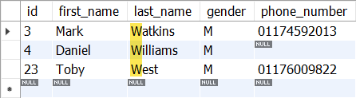

**Practice**
```sql
USE coffee_store;
 
/*
%  match any number of characters.
 
_  match just one character.
*/
 
SELECT * FROM customers
WHERE last_name LIKE 'W%';

SELECT * FROM customers
WHERE last_name LIKE '%o%';

SELECT * FROM customers
WHERE first_name LIKE '%o%';

SELECT * FROM customers
WHERE first_name LIKE '_o_';

SELECT * FROM customers
WHERE first_name LIKE '_o__';

SELECT * FROM products;

SELECT * FROM products
WHERE price LIKE '3%';
```
<div align="right">
  <strong>
    <a href="#table-of-contents" style="text-decoration: none;">↥ Back to top</a>
  </strong>
</div>

### Order By
#### SQL for 'Sorting Data' in a Query
This command retrieves all records from a table and orders the results based on a specified column. The **ORDER BY** clause is used to sort the data in ascending (**ASC**) or descending (**DESC**) order.

**ASC (Ascending)** – Default order, sorts from smallest to largest (A-Z, 0-9).  
**DESC (Descending)** – Sorts from largest to smallest (Z-A, 9-0).  

```sql
SELECT * FROM <table_name>  
ORDER BY <column_name> <ASC|DESC>;  
```
**Example**
```sql
SELECT * FROM customers  
ORDER BY last_name DESC; 
```
This example selects all records from the customers table and sorts them by last_name in **descending** (**Z-A**) order.

**Practice**
```sql
USE coffee_store;

SELECT * FROM products;

SELECT * FROM products
ORDER BY price DESC;

SELECT * FROM customers;

SELECT * FROM customers
ORDER BY last_name DESC;

SELECT * FROM customers
WHERE last_name = 'Bluth'
ORDER BY last_name, first_name;

SELECT * FROM orders
ORDER BY order_time;

SELECT * FROM orders
ORDER BY order_time DESC;
```

<div align="right">
  <strong>
    <a href="#table-of-contents" style="text-decoration: none;">↥ Back to top</a>
  </strong>
</div>

**Exercise 6**
1. From the products table, select the name and price of all products with a coffee origin equal to Colombia or Indonesia. Sort the results by name, from A-Z.  

**Option 1**
```sql
SELECT name, price
FROM products
WHERE coffee_origin = 'Colombia' OR coffee_origin = 'Indonesia'
ORDER BY name;
```
**Option 2**
```sql
SELECT name, price
FROM products
WHERE coffee_origin IN ('Colombia', 'Indonesia')
ORDER BY name ASC;
```

2. From the **orders** table, select all the orders from **February 2023**, for **customers** with IDs of **19, 20, 21 or 24**.   
   
**Option 1**
```sql
SELECT *
FROM orders
WHERE order_time LIKE "2023-02%" AND customer_id IN (19, 20, 21, 24);
```
**Option 2**
```sql
SELECT * FROM orders
WHERE order_time BETWEEN '2023-02-01' AND '2023-02-28 23:59:59.999999'
AND customer_id IN (19, 20, 21, 24);
```

3. From the customers table, select the first name and phone number of all customers whose last name contains the pattern 'ar'.

```sql
SELECT first_name, phone_number
FROM customers
WHERE last_name = '%ar%';
```

<div align="right">
  <strong>
    <a href="#table-of-contents" style="text-decoration: none;">↥ Back to top</a>
  </strong>
</div>

### Distinct
#### SQL for 'Selecting Unique Values' from a Column
The DISTINCT keyword is used to retrieve unique (non-duplicate) values from a specific column in a table. This helps in filtering out repeated entries and showing only distinct results.

```sql
SELECT DISTINCT <column_name>  
FROM <table_name>;
```
**Example**
```sql
SELECT DISTINCT coffee_origin  
FROM products;
```
This example selects all unique values from the coffee_origin column in the products table, ensuring that no duplicate origins are included in the result set.

**Practice**
```sql
use coffee_store;
 
SELECT coffee_origin FROM products;

SELECT DISTINCT coffee_origin FROM products;

SELECT DISTINCT coffee_origin, id FROM products;

SELECT DISTINCT coffee_origin, price FROM products;

SELECT DISTINCT customer_id FROM orders
WHERE order_time BETWEEN '2023-02-01' and '2023-02-28 23:59:59.999999'
ORDER BY customer_id;

SELECT DISTINCT customer_id, product_id FROM orders
WHERE order_time BETWEEN '2023-02-01' and '2023-02-28 23:59:59.999999'
ORDER BY customer_id;
```

<div align="right">
  <strong>
    <a href="#table-of-contents" style="text-decoration: none;">↥ Back to top</a>
  </strong>
</div>

### Limit
#### SQL for 'Limiting the Number of Results' in a Query
The **LIMIT** clause is used to restrict the number of rows returned by a query. This is useful when working with large datasets and when only a specific number of records are needed.
```sql
SELECT * 
FROM <table_name>  
LIMIT <number_of_rows>;
```
**Example 1**
```sql
SELECT * FROM customers  
LIMIT 5;  
```
This example retrieves the first 5 records from the customers table. If there are more than 5 records in the table, only the first 5 will be returned.

**Example 2 (LIMIT with OFFSET)**
```sql
SELECT * FROM customers  
LIMIT 5 OFFSET 5; 
``` 
This example **skips the first 5** records and then retrieves the **next 5 records** from the customers table. This is useful for pagination (e.g., fetching the second page of results in a set of 5 records per page).

**Practice**
```sql
USE coffee_store;
 
SELECT * FROM customers;

SELECT * FROM customers
LIMIT 5;

SELECT * FROM customers
LIMIT 5 OFFSET 5;

SELECT * FROM customers
-- LIMIT 12, 3;
LIMIT 3 OFFSET 12;

SELECT * FROM customers
LIMIT `row_count`;  -- only return row-count rows.

SELECT * FROM customers
LIMIT `offset`, `row_count`;  -- return row_count rows, starting from row 5.

SELECT * FROM customers
LIMIT `row_count` OFFSET `offset`;  -- same as above.

SELECT * FROM customers
LIMIT 10 OFFSET 5;

SELECT * FROM customers
ORDER BY last_name
LIMIT 10;
```

<div align="right">
  <strong>
    <a href="#table-of-contents" style="text-decoration: none;">↥ Back to top</a>
  </strong>
</div>
